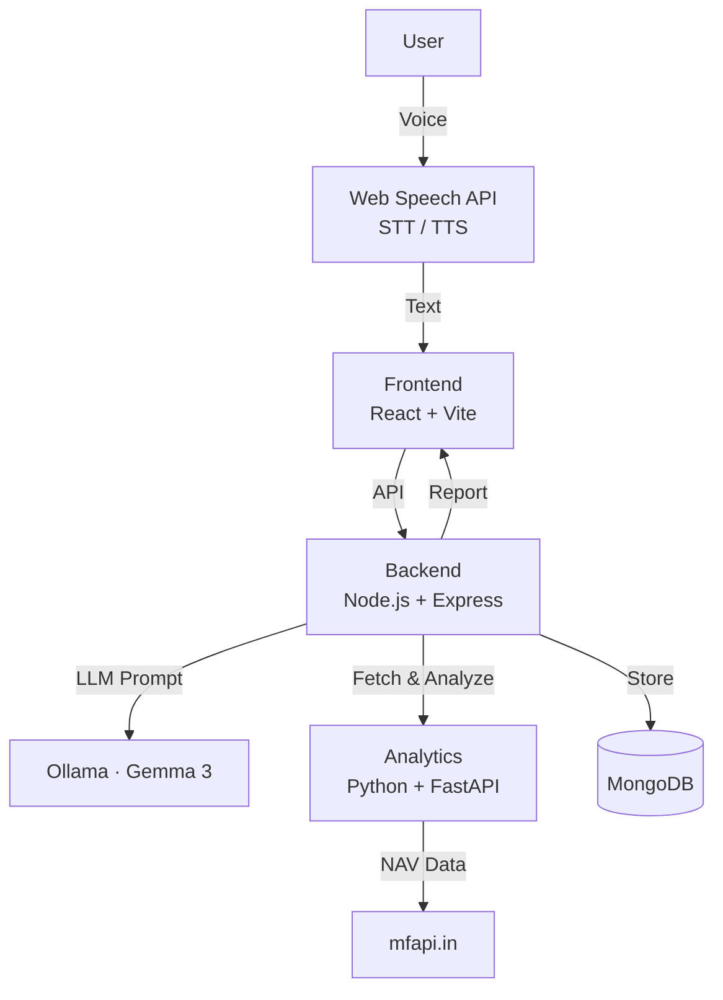

<div align="center">
  <picture>
    <source media="(prefers-color-scheme: dark)" srcset="https://placehold.co/1200x400/0a0a0a/ffffff?text=AI+Voice+Advisor&font=source-code-pro">
    
  </picture>
</div>

<h1 align="center">AI Voice-Driven Mutual Fund Advisor</h1>

<p align="center">
  <b>Your voice-powered financial guide — simplifying mutual fund investments through natural conversation.</b>
</p>

<p align="center">
  <a href="#"></a>
  <a href="#"></a>
  <a href="#"></a>
  <a href="#"></a>
</p>

<p align="center">
  <a href="https://github.com/HARSHILL2023/codeavengers/stargazers"></a>
  <a href="https://github.com/HARSHILL2023/codeavengers/network/members"></a>
  <a href="https://github.com/HARSHILL2023/codeavengers/issues"></a>
  <a href="./LICENSE"></a>
  <a href="https://github.com/HARSHILL2023/codeavengers/graphs/contributors"></a>
</p>

---

## Overview

**Millions of beginners find mutual funds intimidating** — jargon, endless choices, and complex data create a barrier to informed investing.

**Advisor** breaks that barrier. It's a voice-first AI assistant that understands natural language, adaptively profiles your risk appetite, analyzes real market data, and generates a personalized investment report — all through a conversation that feels human.

**Who it helps:** Young professionals exploring their first investments, families seeking simplified guidance, beginners wanting to learn without the jargon, and anyone who prefers speaking over filling out forms.

---

## Features

| Category | Features |
|---|---|
| **🎙️ Voice** | Speech-to-Text, Text-to-Speech, real-time transcription, noise handling |
| **🧠 AI** | Natural language understanding via Ollama + Gemma 3, conversation memory, adaptive questioning, risk classification |
| **📊 Analytics** | CAGR, volatility, Sharpe ratio, maximum drawdown, historical NAV (10+ yrs) |
| **🔒 Security** | Input validation, rate limiting, centralized error handling, env isolation |
| **🚧 Future** | Multi-language, portfolio simulation, fund comparison, SIP calculator |

---

## Demo

<p align="center">
  <table>
    <tr>
      <td align="center"><b>🔗 Live Demo</b></td>
      <td align="center"><b>🎥 Demo Video</b></td>
      <td align="center"><b>📊 Presentation</b></td>
    </tr>
    <tr>
      <td align="center"><a href="#">Coming Soon</a></td>
      <td align="center"><a href="#">Coming Soon</a></td>
      <td align="center"><a href="#">Coming Soon</a></td>
    </tr>
  </table>
</p>

---

## Tech Stack

| Category | Technology |
|---|---|
| **Frontend** | React 18 + Vite · Web Speech API |
| **Backend** | Node.js + Express · MongoDB + Mongoose |
| **AI / LLM** | Ollama + Gemma 3 (local) |
| **Analytics** | Python + FastAPI · pandas + NumPy |
| **Data Source** | [mfapi.in](https://www.mfapi.in) (Mutual Fund Data) |

---

## Architecture



**Flow:** User speaks → Speech-to-Text → LLM risk analysis → Fetch real fund data → Compute metrics → Generate personalized report → Display in frontend.

---

## Installation

### Prerequisites

Make sure the following are installed on your machine:

- Node.js 18+ and npm
- Python 3.10+
- Ollama installed and available in your PATH
- MongoDB running locally or a MongoDB Atlas connection string

### 1) Clone the repo

```powershell
git clone https://github.com/HARSHILL2023/codeavengers.git
cd advisor-project
```

### 2) Install dependencies

```powershell
# Backend
cd advisor-backend
npm install
Copy-Item .env.example .env

# Frontend
cd ../advisor-frontend
npm install
Copy-Item .env.example .env

# Analytics
cd ../advisor-analytics
python -m venv .venv
.\.venv\Scripts\Activate.ps1
pip install -r requirements.txt
```

If PowerShell blocks script activation, run:

```powershell
Set-ExecutionPolicy -Scope Process Bypass
```

### 3) Pull the local LLM model

```powershell
ollama pull llama3.2:3b
```

### 4) Run the services

Open separate terminals and run the following commands.

#### Terminal 1 — Analytics API

```powershell
cd advisor-project\advisor-analytics
.\.venv\Scripts\Activate.ps1
uvicorn main:app --reload --port 8000
```

#### Terminal 2 — Backend API

```powershell
cd advisor-project\advisor-backend
ollama serve
node server.js
```

#### Terminal 3 — Frontend

```powershell
cd advisor-project\advisor-frontend
npm run dev
```

You can also start everything from the repo root with:

```powershell
.\start-all.ps1
```

### Sample environment files

Backend environment variables in [advisor-backend/.env.example](advisor-backend/.env.example):

```env
PORT=5000
MONGODB_URI=mongodb://127.0.0.1:27017/advisorDB
ANALYTICS_SERVICE_URL=http://localhost:8000
OLLAMA_URL=http://localhost:11434
OLLAMA_MODEL=llama3.2:3b
```

Frontend environment variables in [advisor-frontend/.env.example](advisor-frontend/.env.example):

```env
VITE_API_URL=http://localhost:5000/api
VITE_SUPABASE_URL=https://your-project.supabase.co
VITE_SUPABASE_ANON_KEY=your-anon-key
```

---

## Environment Variables

| Service | Variable | Description | Required |
|---|---|---|---|
| Backend | `PORT` | Backend port | ❌ |
| Backend | `MONGODB_URI` | MongoDB connection string | ✅ |
| Backend | `ANALYTICS_SERVICE_URL` | Analytics service base URL | ❌ |
| Backend | `OLLAMA_URL` | Ollama base URL | ❌ |
| Backend | `OLLAMA_MODEL` | Ollama model name | ❌ |
| Frontend | `VITE_API_URL` | Backend API URL | ❌ |
| Frontend | `VITE_SUPABASE_URL` | Supabase project URL | ❌ |
| Frontend | `VITE_SUPABASE_ANON_KEY` | Supabase anonymous key | ❌ |

---

## Usage

1. Open `http://localhost:5173` in Chrome/Edge
2. Click the **microphone** and start speaking
3. The AI asks about your financial goals, income, and timeline
4. Your risk profile is classified as **Conservative** 🟢, **Moderate** 🟡, or **Aggressive** 🔴
5. Real fund data is fetched matching your profile
6. A personalized investment report is generated with CAGR, volatility, Sharpe ratio, and recommendations

---

## Screenshots

<p align="center">
  <table>
    <tr>
      <td><br/><b>Landing</b></td>
      <td><br/><b>Voice</b></td>
    </tr>
    <tr>
      <td><br/><b>Chat</b></td>
      <td><br/><b>Report</b></td>
    </tr>
  </table>
</p>

---

## AI Workflow

| Step | Description |
|---|---|
| **Speech → Text** | Web Speech API captures audio and transcribes in-browser — zero external STT services |
| **Conversation Memory** | Full session history stored in MongoDB, fed to LLM for coherent multi-turn dialogue |
| **Adaptive Questioning** | LLM assesses information gaps and dynamically generates follow-up questions |
| **Risk Classification** | Structured prompting classifies users into Conservative / Moderate / Aggressive |
| **Analytics Engine** | Python service fetches NAV data via mfapi.in, computes CAGR/volatility/Sharpe/drawdown with pandas |
| **Report Generation** | LLM receives analytics data and produces a human-readable investment report |

---

## Roadmap

| Phase | Features |
|---|---|
| **✅ v1.0** | Voice conversation, adaptive risk profiling, real fund data, personalized reports, financial analytics |
| **🚧 v1.5** | Multi-language support, fund comparison, portfolio simulation, PDF export |
| **🔮 v2.0** | User accounts, email/SMS delivery, SIP calculator, mobile app, real-time market data |

---

## Authors

<p align="center">
  <table>
    <tr><th>Name</th><th>GitHub</th></tr>
    <tr><td>Harshil Patel</td><td><a href="https://github.com/HARSHILL20233">@HARSHILL20233</a></td></tr>
    <tr><td>Anand Suthar</td><td><a href="https://github.com/anand880441-source">@anand880441-source</a></td></tr>
    <tr><td>Trikum Devasi</td><td><a href="https://github.com/TrikamDevasi">@TrikamDevasi</a></td></tr>
    <tr><td>Pritesh Bachhav</td><td><a href="https://github.com/BachhavPritesh">@BachhavPritesh</a></td></tr>
  </table>
</p>

---

## License

MIT — see [`LICENSE`](./LICENSE).

---

## Acknowledgements

**Hackathon organizers** · **mfapi.in** (free mutual fund data) · **Ollama** (local LLMs) · **React + Vite** · **FastAPI + pandas**

---

<div align="center">
  <br />
  <picture>
    <source media="(prefers-color-scheme: dark)" srcset="https://placehold.co/600x120/0a0a0a/ffffff?text=⭐+Star+this+Project+⭐&font=source-code-pro">
    
  </picture>
  <br />
  <b>If you found this helpful, give it a ⭐ on GitHub!</b>
  <br /><br />
  <a href="https://github.com/HARSHILL2023/codeavengers/stargazers"></a>
  <a href="https://github.com/HARSHILL2023/codeavengers/fork"></a>
  <br /><br />
  <small>Built with ❤️ for hackathon</small>
</div>
