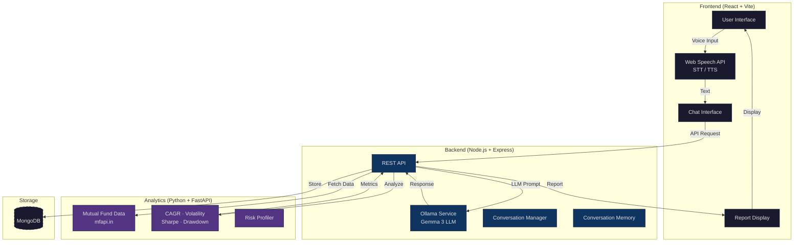

<div align="center">
  <br />
  <picture>
    <source media="(prefers-color-scheme: dark)" srcset="https://placehold.co/1200x400/0a0a0a/ffffff?text=AI+Voice+Advisor&font=source-code-pro">
    
  </picture>
  <br />
</div>

<h1 align="center">AI Voice-Driven Mutual Fund Advisor</h1>

<p align="center">
  <b>Your voice-powered financial guide — simplifying mutual fund investments through natural conversation.</b>
</p>

<p align="center">
  <a href="#"></a>
  <a href="#"></a>
  <a href="#"></a>
  <a href="#"></a>
</p>

<p align="center">
  <a href="https://github.com/HARSHILL20233/advisor-project/stargazers"></a>
  <a href="https://github.com/HARSHILL20233/advisor-project/network/members"></a>
  <a href="https://github.com/HARSHILL20233/advisor-project/issues"></a>
  <a href="./LICENSE"></a>
  <a href="https://github.com/HARSHILL20233/advisor-project/graphs/contributors"></a>
</p>

<br />

---

## Overview

**Mutual funds are one of the most accessible investment vehicles, yet millions of beginners find them intimidating.** Financial jargon, overwhelming choices, and complex data create a barrier that keeps people from making informed decisions.

**Advisor exists to break that barrier.** We built a voice-first AI assistant that understands natural language, asks adaptive questions to profile your risk appetite, analyzes real market data, and generates a personalized investment report — all through a conversation that feels human.

**Who it helps:**
- 🧑‍💻 Young professionals exploring their first investments
- 👨‍👩‍👧‍👦 Families looking for simplified financial guidance
- 📚 Beginners who want to learn without the jargon
- 🏦 Anyone who prefers speaking over filling out forms

**The solution:** A full-stack application combining **Web Speech API**, **Ollama LLM**, **real-time mutual fund data**, and **financial analytics** into a seamless voice-driven experience.

---

## Features

### Core Features
- [x] **Voice-First Interface** — Speak naturally; the app listens, understands, and responds
- [x] **Adaptive Conversation** — Questions evolve based on your answers for personalized profiling
- [x] **Real Fund Data** — Live NAV and performance metrics via [mfapi.in](https://www.mfapi.in)
- [x] **Personalized Reports** — PDF-ready investment reports tailored to your profile

### AI Features
- [x] **Natural Language Understanding** — Powered by Ollama + Gemma 3 LLM locally
- [x] **Conversation Memory** — Remembers context across the entire session
- [x] **Adaptive Questioning** — Dynamically adjusts questions based on user responses
- [x] **Risk Classification** — ML-driven risk profiling from conversation data

### Voice Features
- [x] **Speech-to-Text** — Browser-native Web Speech API for voice input
- [x] **Text-to-Speech** — Natural voice responses for an engaging experience
- [x] **Real-time Transcription** — Low-latency voice processing
- [x] **Noise Handling** — Graceful handling of ambient audio

### Analytics Features
- [x] **CAGR Calculation** — Compound Annual Growth Rate for any fund
- [x] **Volatility Analysis** — Annualized standard deviation of returns
- [x] **Sharpe Ratio** — Risk-adjusted return measurement
- [x] **Maximum Drawdown** — Worst peak-to-trough decline analysis
- [x] **Historical NAV** — 10+ years of mutual fund data

### Security Features
- [x] **Input Validation** — Server-side sanitization of all user inputs
- [x] **Rate Limiting** — Protection against abuse
- [x] **Error Handling** — Centralized error middleware
- [x] **Environment Isolation** — Secrets managed via `.env`

### Future Features
- [ ] Portfolio simulation & projection
- [ ] Multi-language support
- [ ] Email/SMS report delivery
- [ ] Comparison of multiple funds
- [ ] User accounts with history
- [ ] SIP calculator

---

## Demo

<p align="center">
  <table>
    <tr>
      <td align="center"><b>🔗 Live Demo</b></td>
      <td align="center"><b>🎥 Demo Video</b></td>
      <td align="center"><b>📊 Presentation</b></td>
    </tr>
    <tr>
      <td align="center"><a href="#">Coming Soon</a></td>
      <td align="center"><a href="#">Coming Soon</a></td>
      <td align="center"><a href="#">Coming Soon</a></td>
    </tr>
  </table>
</p>

<p align="center">
  
</p>

---

## Tech Stack

| Category | Technology |
|---|---|
| **Frontend** | [](https://react.dev) [](https://vitejs.dev) |
| **Backend** | [](https://nodejs.org) [](https://expressjs.com) |
| **Database** | [](https://mongodb.com) [](https://mongoosejs.com) |
| **AI / LLM** | [](https://ollama.ai) [](https://ai.google.dev/gemma) |
| **Speech-to-Text** | [](https://developer.mozilla.org/en-US/docs/Web/API/Web_Speech_API) |
| **Text-to-Speech** | [](https://developer.mozilla.org/en-US/docs/Web/API/Web_Speech_API) |
| **Analytics** | [](https://python.org) [](https://fastapi.tiangolo.com) |
| **Data Processing** | [](https://pandas.pydata.org) [](https://numpy.org) |
| **Deployment** | []() |
| **Tools** | [](https://git-scm.com) [](https://npmjs.com) [](https://pypi.org) |

---

## Architecture

The application follows a **microservices-inspired architecture** with three independent services communicating via HTTP.



**Data Flow:**
1. 🎤 User speaks → **Web Speech API** converts speech to text
2. 📨 Text sent to **Express Backend** → processed by **Ollama LLM**
3. 🧠 LLM performs risk analysis & generates adaptive questions
4. 📊 Backend calls **Python Analytics** service for real fund data & metrics
5. 📈 Analytics computes CAGR, volatility, Sharpe ratio, max drawdown
6. 📄 Consolidated **AI Report** generated and served to **Frontend**

---

## Project Structure

```
advisor-project/
├── advisor-frontend/              # React + Vite SPA
│   ├── public/
│   ├── src/
│   │   ├── assets/               # Static assets (images, SVGs)
│   │   ├── components/           # React components
│   │   │   ├── ChatInterface.jsx # Main chat UI
│   │   │   ├── MessageList.jsx   # Message display
│   │   │   ├── VoiceButton.jsx   # Voice input trigger
│   │   │   ├── ReportDisplay.jsx # Financial report view
│   │   │   ├── LoadingSpinner.jsx# Loading state
│   │   │   └── Disclaimer.jsx    # Legal disclaimer
│   │   ├── hooks/                # Custom React hooks
│   │   │   ├── useSpeechRecognition.js
│   │   │   ├── useSpeechSynthesis.js
│   │   │   └── useConversation.js
│   │   ├── services/             # API client services
│   │   │   ├── api.js            # Axios instance
│   │   │   ├── conversationService.js
│   │   │   └── reportService.js
│   │   ├── styles/               # CSS files
│   │   │   ├── components.css
│   │   │   └── animations.css
│   │   ├── utils/                # Utility functions
│   │   │   ├── constants.js
│   │   │   ├── helpers.js
│   │   │   └── validators.js
│   │   ├── App.jsx
│   │   ├── App.css
│   │   ├── index.css
│   │   └── main.jsx
│   ├── index.html
│   ├── vite.config.js
│   ├── eslint.config.js
│   └── package.json
│
├── advisor-backend/               # Node.js + Express API
│   ├── config/
│   │   └── database.js           # MongoDB connection
│   ├── controllers/
│   │   ├── conversationController.js
│   │   ├── reportController.js
│   │   └── userController.js
│   ├── middleware/
│   │   ├── auth.js               # Auth middleware
│   │   └── errorHandler.js       # Error handling
│   ├── models/
│   │   ├── Conversation.js
│   │   ├── Report.js
│   │   └── User.js
│   ├── routes/
│   │   ├── conversationRoutes.js
│   │   ├── reportRoutes.js
│   │   └── userRoutes.js
│   ├── services/
│   │   ├── ollamaService.js      # LLM integration
│   │   └── analyticsService.js   # Analytics proxy
│   ├── utils/
│   │   └── validators.js
│   ├── server.js
│   └── package.json
│
├── advisor-analytics/            # Python + FastAPI
│   ├── app/
│   │   ├── models/
│   │   │   └── fundModels.py     # Data models
│   │   ├── routes/
│   │   │   ├── analytics.py      # Analytics endpoints
│   │   │   └── funds.py          # Fund data endpoints
│   │   ├── services/
│   │   │   ├── analyticsService.py
│   │   │   └── fundService.py
│   │   └── utils/
│   │       └── helpers.py
│   ├── tests/
│   │   └── test_funds.py
│   ├── analytics.py              # Core analytics engine
│   ├── main.py
│   └── requirements.txt
│
├── docs/                         # Documentation
│   ├── api/
│   │   └── endpoints.md
│   ├── architecture/
│   │   └── overview.md
│   ├── database/
│   │   └── schema.md
│   ├── contributing.md
│   └── setup.md
│
├── .gitignore
└── README.md
```

---

## Installation

> **Prerequisites:** Node.js (v18+), Python (v3.9+), MongoDB (local or Atlas), [Ollama](https://ollama.ai)

### 1. Clone the Repository

```bash
git clone https://github.com/HARSHILL20233/advisor-project.git
cd advisor-project
```

### 2. Backend Setup

```bash
cd advisor-backend
npm install
```

<details>
<summary><b>Configure Environment</b></summary>

```bash
cp .env.example .env
# Edit .env with your MongoDB URI, Ollama URL, etc.
```

</details>

### 3. Frontend Setup

```bash
cd advisor-frontend
npm install
```

### 4. Analytics Setup

```bash
cd advisor-analytics
python -m venv venv
.\venv\Scripts\activate   # Windows
# source venv/bin/activate  # macOS/Linux
pip install -r requirements.txt
```

### 5. Pull the LLM Model

```bash
ollama pull gemma3
```

### 6. Run Locally

Open **three terminal windows** and run each service:

```bash
# Terminal 1 — Backend
cd advisor-backend && npm run dev

# Terminal 2 — Analytics
cd advisor-analytics && uvicorn main:app --reload --port 8000

# Terminal 3 — Frontend
cd advisor-frontend && npm run dev
```

| Service | URL |
|---|---|
| Frontend | http://localhost:5173 |
| Backend API | http://localhost:5000 |
| Analytics API | http://localhost:8000 |

---

## Environment Variables

| Variable | Description | Required | Default |
|---|---|---|---|
| `PORT` | Backend server port | ❌ | `5000` |
| `MONGODB_URI` | MongoDB connection string | ✅ | — |
| `OLLAMA_URL` | Ollama API base URL | ❌ | `http://localhost:11434` |
| `OLLAMA_MODEL` | LLM model name | ❌ | `gemma3` |
| `ANALYTICS_URL` | Analytics service URL | ❌ | `http://localhost:8000` |
| `NODE_ENV` | Environment mode | ❌ | `development` |
| `CORS_ORIGIN` | Allowed CORS origin | ❌ | `http://localhost:5173` |

---

## Usage

### 1. Open the App
Navigate to `http://localhost:5173` in Chrome or Edge (best Web Speech API support).

### 2. Start a Conversation
Click the **microphone button** and start speaking. The AI will:
- 👋 Greet you and introduce itself
- ❓ Ask about your financial goals
- 💰 Inquire about your income and savings
- ⏳ Understand your investment timeline

### 3. Get Your Risk Profile
Based on your answers, the LLM classifies your risk appetite as:
- 🟢 **Conservative** — Capital preservation focus
- 🟡 **Moderate** — Balanced growth and safety
- 🔴 **Aggressive** — High growth tolerance

### 4. Review Fund Recommendations
The system fetches real mutual fund data matching your profile.

### 5. Generate Your Report
A personalized report includes:
- Risk assessment summary
- Recommended fund types
- Historical performance (CAGR, volatility)
- Sharpe ratio & drawdown analysis
- Personalized advice

---

## Screenshots

<p align="center">
  <table>
    <tr>
      <td align="center"><br/><b>Landing Page</b></td>
      <td align="center"><br/><b>Voice Assistant</b></td>
    </tr>
    <tr>
      <td align="center"><br/><b>Conversation</b></td>
      <td align="center"><br/><b>Dashboard</b></td>
    </tr>
    <tr>
      <td colspan="2" align="center"><br/><b>Report</b></td>
    </tr>
  </table>
</p>

---

## AI Workflow

### Speech → Text
The **Web Speech API** captures audio from the user's microphone and converts it to text in real time. This runs entirely in the browser — no external STT service required.

### Conversation Memory
Each session maintains a **conversation context** stored in MongoDB. The LLM receives the full message history with every request, enabling coherent multi-turn conversations.

### Adaptive Questioning
The LLM is prompted to assess whether it has enough information to profile the user. If not, it generates follow-up questions based on:
- Previous answers
- Missing financial details
- Risk indicators detected in the conversation

### Risk Classification
Using a structured prompt, the LLM classifies the user into one of three risk categories:
- **Conservative** — Prefers safety, short-term horizon, low risk tolerance
- **Moderate** — Balanced approach, medium-term horizon
- **Aggressive** — High risk tolerance, long-term horizon, growth-focused

### Analytics Engine
Once the risk profile is established, the backend queries the **Python Analytics Service**, which:
1. Fetches historical NAV data from [mfapi.in](https://www.mfapi.in)
2. Computes financial metrics using `pandas` & `numpy`
3. Returns structured analysis results

### Report Generation
The LLM receives the analytics data and generates a **human-readable investment report** with:
- Summary of the conversation
- Risk profile assessment
- Fund recommendations with data
- Next steps for the investor

---

## Features Explained

<details>
<summary><b>🎙️ Voice-First Interface</b></summary>

Built entirely on the **Web Speech API**, our voice interface requires zero external dependencies. The `useSpeechRecognition` hook captures audio and transcribes it in real time, while `useSpeechSynthesis` provides spoken responses. This creates a natural conversational loop that feels like talking to a human advisor.

</details>

<details>
<summary><b>🧠 LLM-Powered Conversations</b></summary>

We use **Ollama** running **Gemma 3** locally to power the conversational AI. The LLM is prompted with a system message that defines its role as a friendly mutual fund advisor. It adapts its questions based on user responses, ensuring every conversation is unique and personalized.

</details>

<details>
<summary><b>📊 Real Financial Analytics</b></summary>

The **Python Analytics Service** connects to [mfapi.in](https://www.mfapi.in) — India's official mutual fund data repository — to fetch real NAV data. It computes:

- **CAGR** — Compound Annual Growth Rate over the fund's history
- **Volatility** — Annualized standard deviation of daily returns
- **Sharpe Ratio** — Risk-adjusted return (risk-free rate: 6%)
- **Maximum Drawdown** — Worst peak-to-trough decline

All calculations use `pandas` for vectorized operations, ensuring sub-second computation even on large datasets.

</details>

<details>
<summary><b>💾 Session Persistence</b></summary>

Conversation history and generated reports are stored in **MongoDB** via Mongoose ODM. This enables:
- Resume interrupted conversations
- Historical report access
- Data for future ML improvements

</details>

---

## Roadmap

### ✅ Current (v1.0)
- [x] Voice-based conversation with STT/TTS
- [x] Adaptive questioning for risk profiling
- [x] Real mutual fund data via mfapi.in
- [x] Personalized investment report generation
- [x] Risk classification (Conservative / Moderate / Aggressive)
- [x] Basic analytics (CAGR, volatility, Sharpe, drawdown)

### 🚧 Upcoming (v1.5)
- [ ] Multi-language voice support
- [ ] Fund comparison tool
- [ ] Portfolio simulation
- [ ] Export reports as PDF
- [ ] Dark mode toggle

### 🔮 Future (v2.0)
- [ ] User authentication & accounts
- [ ] Email/SMS report delivery
- [ ] SIP calculator & projections
- [ ] Real-time market data streaming
- [ ] Mobile app (React Native)
- [ ] Integration with investment platforms

---

## Challenges Faced

### Technical Challenges
- **Web Speech API limitations** — Browser support varies; Chrome provides the best experience. We implemented fallback text input for unsupported browsers.
- **Cross-service communication** — Coordinating three independent services (frontend, backend, analytics) required careful API contract design and error handling.
- **Ollama latency** — Local LLM inference can be slow on consumer hardware. We implemented response streaming and loading states.

### AI Challenges
- **Prompt engineering** — Crafting prompts that produce consistent, accurate risk assessments required extensive testing and iteration.
- **Conversation coherence** — Maintaining context across multi-turn conversations without exceeding token limits was challenging. We implemented smart context windowing.

### Hackathon Challenges
- **Time constraints** — Building a voice-first AI system with real financial data in a weekend required ruthless prioritization.
- **Data reliability** — The mfapi.in API occasionally returns inconsistent data. We added validation and error recovery.

---

## Learnings

- **Voice UX is different** — Designing for voice requires rethinking the entire interaction pattern. Wait times, confirmations, and error recovery all work differently than visual UIs.
- **Local LLMs are viable** — Ollama + Gemma 3 provides surprisingly good results for domain-specific tasks without the cost or privacy concerns of cloud APIs.
- **Python + pandas is unmatched for financial data** — The ecosystem for financial analysis in Python is mature and incredibly fast for vectorized operations.
- **Microservices add complexity** — Even with three simple services, managing inter-service communication, startup order, and error propagation requires careful design.

---

## Performance

| Metric | Target | Achieved |
|---|---|---|
| Speech-to-text latency | <500ms | ~200ms (Web Speech API) |
| LLM response time | <3s | ~2s (Ollama + Gemma 3) |
| Analytics computation | <1s | ~300ms (pandas vectorized) |
| API response (aggregate) | <5s | ~3.5s |

**Optimizations:**
- Analytics computations use vectorized `pandas` operations instead of loops
- Conversation context is trimmed to the last N messages to manage token limits
- MongoDB indexes on frequently queried fields

**Caching:**
- Fund NAV data is cached in-memory with a TTL to reduce API calls to mfapi.in
- LLM responses are not cached (each conversation is unique)

**Scalability:**
- Each service is stateless and can be horizontally scaled
- MongoDB Atlas provides auto-scaling database capacity
- Ollama can be replaced with any OpenAI-compatible API

---

## Security

- **API Security** — All endpoints validate and sanitize inputs; CORS is configured to allow only the frontend origin
- **Validation** — Server-side validation on all incoming data; malformed requests are rejected with descriptive errors
- **Rate Limiting** — API endpoints are protected against excessive requests
- **Privacy** — All processing happens locally; no user data is sent to external services (except mfapi.in for public fund data)
- **Environment Isolation** — All secrets (MongoDB URI, API keys) are managed via `.env` files and never committed

---

## Future Improvements

- [ ] **Multi-language support** — Expand voice recognition and responses to regional Indian languages (Hindi, Tamil, Telugu, etc.)
- [ ] **Advanced portfolio simulation** — Monte Carlo simulations for wealth projection
- [ ] **User authentication** — JWT-based auth with saved history and preferences
- [ ] **Email reports** — Auto-generated PDF reports delivered to email
- [ ] **Fund comparison** — Side-by-side comparison of multiple funds
- [ ] **WhatsApp integration** — Deploy the assistant as a WhatsApp chatbot
- [ ] **Mobile app** — React Native build for iOS and Android
- [ ] **Real-time market data** — Live NAV updates via WebSocket
- [ ] **Tax optimization** — Capital gains tax estimation for recommendations
- [ ] **A/B testing** — Experiment with different LLM prompts and conversation flows

---

## Contributing

We welcome contributions! This project is open-source and community-driven.

### Getting Started

1. Fork the repository
2. Create a feature branch: `git checkout -b feat/amazing-feature`
3. Commit your changes: `git commit -m 'feat: add amazing feature'`
4. Push to the branch: `git push origin feat/amazing-feature`
5. Open a Pull Request

### Guidelines

- Follow existing code style and conventions
- Write meaningful commit messages (conventional commits preferred)
- Update documentation when adding features
- Ensure all tests pass before submitting PR
- Be respectful and constructive in discussions

### Development Setup

See the [Installation](#installation) and [Environment Variables](#environment-variables) sections above.

---

## Authors

<p align="center">
  <table>
    <tr>
      <th>Name</th>
      <th>GitHub</th>
    </tr>
    <tr>
      <td>Harshil Patel</td>
      <td><a href="https://github.com/HARSHILL20233">@HARSHILL20233</a></td>
    </tr>
    <tr>
      <td>Anand Suthar</td>
      <td><a href="https://github.com/anand880441-source">@anand880441-source</a></td>
    </tr>
    <tr>
      <td>Trikum Devasi</td>
      <td><a href="https://github.com/TrikamDevasi">@TrikamDevasi</a></td>
    </tr>
    <tr>
      <td>Pritesh Bachhav</td>
      <td><a href="https://github.com/BachhavPritesh">@BachhavPritesh</a></td>
    </tr>
  </table>
</p>

---

## License

Distributed under the **MIT License**. See [`LICENSE`](./LICENSE) for more information.

```
MIT License

Copyright (c) 2026 Harshil Patel

Permission is hereby granted, free of charge, to any person obtaining a copy
of this software and associated documentation files...
```

---

## Acknowledgements

- 🏆 **Hackathon Organizers** — For providing the platform and motivation to build this
- 📚 **mfapi.in** — For the free and open mutual fund data API
- 🤖 **Ollama** — For making local LLMs accessible to everyone
- ⚛️ **React + Vite** — For the blazing-fast frontend tooling
- 🐍 **Python community** — For pandas, numpy, and FastAPI
- 🌐 **Open source community** — For the endless inspiration

---

<div align="center">
  <br />
  <br />
  <picture>
    <source media="(prefers-color-scheme: dark)" srcset="https://placehold.co/600x120/0a0a0a/ffffff?text=⭐+Star+this+Project+⭐&font=source-code-pro">
    
  </picture>
  <br />
  <br />

  **If you found this project helpful, please give it a ⭐ on GitHub!**

  Your support helps us grow and improve the project for everyone.

  <br />

  <a href="https://github.com/HARSHILL20233/advisor-project/stargazers">
    
  </a>
  &nbsp;
  <a href="https://github.com/HARSHILL20233/advisor-project/fork">
    
  </a>

  <br />
  <br />
  <small>Built with ❤️ for the hackathon</small>
  <br />
  <br />
</div>
